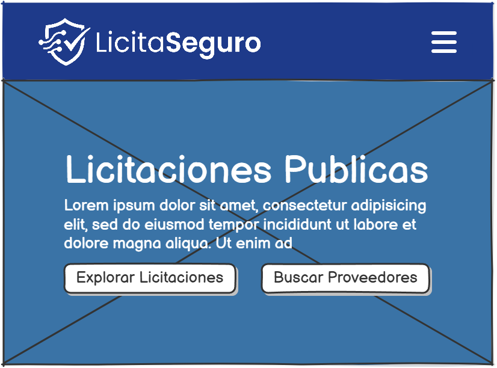
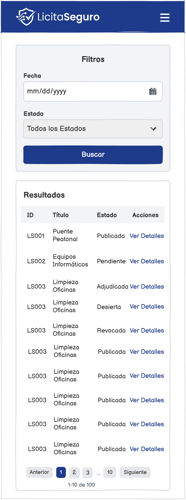
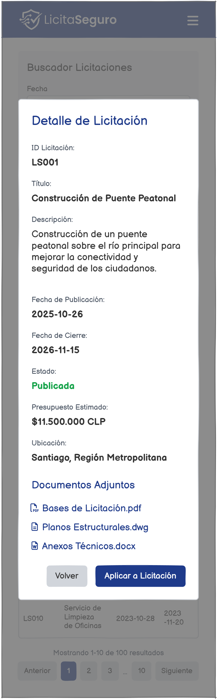
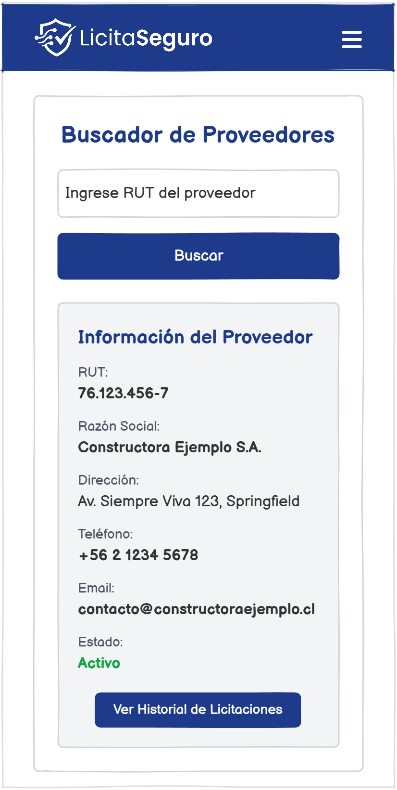
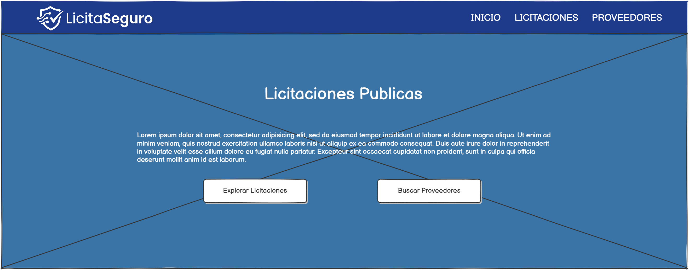
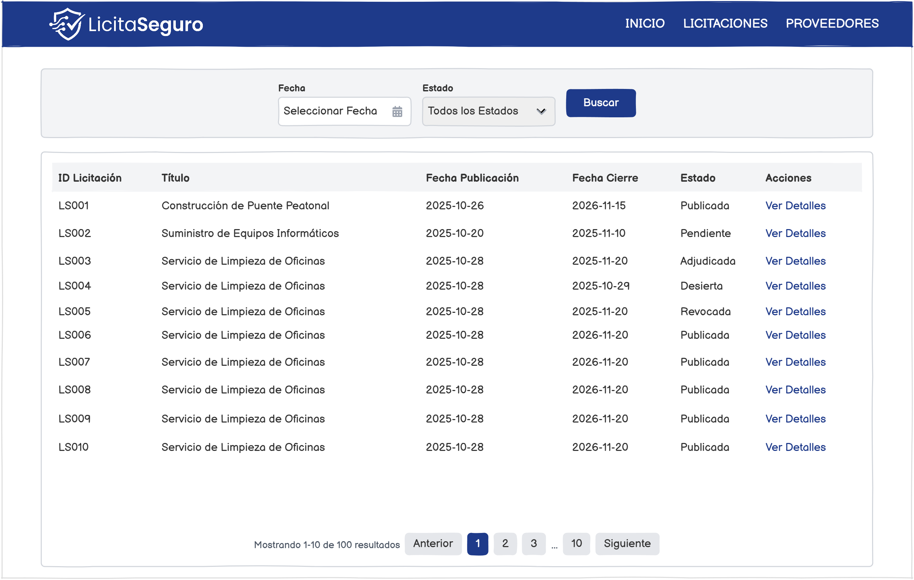
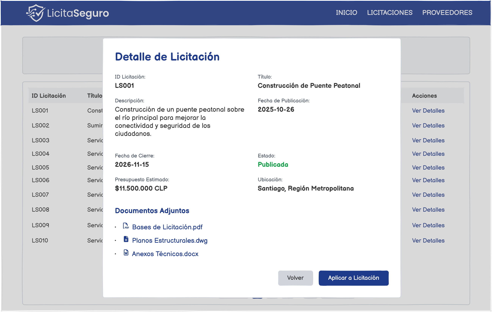
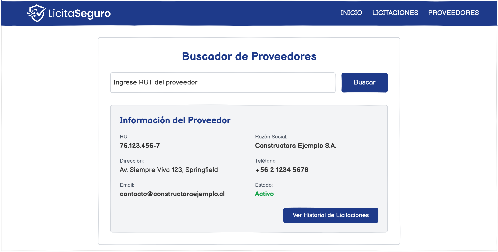

# LicitaSeguro

**Examen Final — Desarrollo Frontend**
**Instituto Profesional San Sebastián**
**Integrante:** Cristóbal Bustos
**Grupo:** CristobalBustos

---
## Link al Repositorio (GitHub)
>https://github.com/CrisBustosE/examen_licitaseguro_bustos
---

## Índice

1. [Descripción del Proyecto](#descripción-del-proyecto)
2. [Tecnologías Utilizadas](#tecnologías-utilizadas)
3. [Estructura del Proyecto](#estructura-del-proyecto)
4. [Instalación y Ejecución](#instalación-y-ejecución)
5. [Endpoints Consumidos](#endpoints-consumidos)
6. [Decisiones de Diseño UI/UX](#decisiones-de-diseño-uiux)
7. [Mockups](#mockups)
8. [Accesibilidad](#accesibilidad)
9. [Responsividad](#responsividad)
10. [Funcionalidades Implementadas](#funcionalidades-implementadas)
11. [Manejo de Errores](#manejo-de-errores)

---

## Descripción del Proyecto

LicitaSeguro es un portal web público desarrollado para la empresa **LicitaSeguro**, compañía dedicada a facilitar información transparente y accesible sobre licitaciones públicas en Chile. El sitio consume la API oficial de Mercado Público y permite a los usuarios:

- Consultar y navegar el listado de licitaciones disponibles.
- Filtrar licitaciones por fecha y estado.
- Ver el detalle completo de cada licitación.
- Buscar proveedores registrados en ChileCompra por RUT.
- Acceder a un homepage corporativo que centraliza el acceso a todos los módulos.

---

## Tecnologías Utilizadas

| Tecnología | Versión | Propósito |
|---|---|---|
| React | 19 | Framework UI y manejo de componentes |
| Vite | 6 | Bundler y servidor de desarrollo |
| Bootstrap | 5.3 | Sistema de grilla, componentes UI y responsividad |
| React Router DOM | 7 | Navegación entre páginas (SPA) |
| Font Awesome | 6.5 | Iconografía |
| Inter (Google Fonts) | — | Tipografía principal |

> **Nota:** El profesor autorizó el uso de React en reemplazo de HTML/CSS/JS puro, manteniendo Bootstrap como framework CSS tal como lo indica el enunciado.

---

## Estructura del Proyecto

```
licitaseguro/
├── public/
│   ├── favicon.svg
│   ├── icons.svg
│   └── mockups/
│       ├── desktop-hero.png
│       ├── desktop-licitaciones.png
│       ├── desktop-licitaciones-detalle.png
│       ├── desktop-proveedor.png
│       ├── mobile-hero.png
│       ├── mobile-licitaciones.png
│       ├── mobile-licitaciones-detalle.png
│       └── mobile-proveedor.png
├── src/
│   ├── assets/
│   │   ├── hero.png
│   │   └── img/
│   │       └── logo/
│   │           ├── licita-seguro-logo.png
│   │           └── logo-chilecompra-52.png
│   ├── components/
│   │   ├── Navbar.jsx          # Navbar sticky con hamburguesa controlada por ref
│   │   ├── Footer.jsx          # Footer con logos y créditos
│   │   └── UniversalModal.jsx  # Modal reutilizable para detalle y proveedor
│   ├── pages/
│   │   ├── Home.jsx            # Homepage con hero y CTAs
│   │   ├── Licitaciones.jsx    # Listado, filtros, paginación y detalle
│   │   └── Proveedores.jsx     # Buscador de proveedores por RUT
│   ├── utils/
│   │   └── apiConfig.js        # Centralización de URL base y ticket de API
│   ├── App.jsx                 # Rutas principales con React Router
│   ├── App.css                 # Estilos propios
│   └── main.jsx                # Punto de entrada de la aplicación
├── index.html
├── package.json
└── vite.config.js
```

---

## Instalación y Ejecución

### Prerrequisitos
- Node.js 18 o superior
- npm 9 o superior

### Pasos

```bash
# 1. Clonar el repositorio
git clone https://github.com/CrisBustosE/examen_licitaseguro_bustos

# 2. Acceder al directorio
cd examen_licitaseguro_bustos

# 3. Instalar dependencias
npm install

# 4. Ejecutar en modo desarrollo
npm run dev

# 5. Abrir en el navegador
# http://localhost:5173
```

### Build de producción

```bash
npm run build
npm run preview
```

---

## Endpoints Consumidos

El archivo `src/utils/apiConfig.js` centraliza la configuración de la API para mantener el código limpio y evitar repetición.

### 1. Listado de Licitaciones

```
GET https://api.mercadopublico.cl/servicios/v1/publico/licitaciones.json
    ?fecha=DDMMAAAA
    &estado=<nombre_estado>
    &ticket=<API_TICKET>
```

- El parámetro `fecha` se convierte del formato HTML `YYYY-MM-DD` al formato que exige la API `DDMMAAAA` mediante la función `formatFechaParaApi()`.
- El parámetro `estado` es opcional; si el usuario selecciona "Todos", se omite del request.
- Estados soportados: `publicada`, `cerrada`, `desierta`, `adjudicada`, `revocada`, `suspendida`.

### 2. Detalle de Licitación

```
GET https://api.mercadopublico.cl/servicios/v1/publico/licitaciones.json
    ?codigo=<CodigoExterno>
    &ticket=<API_TICKET>
```

- El `CodigoExterno` se obtiene desde la respuesta del endpoint de listado.
- Se consume al hacer clic en "Ver Detalles" de cualquier fila/card.

### 3. Búsqueda de Proveedor

```
GET https://api.mercadopublico.cl/servicios/v1/Publico/Empresas/BuscarProveedor
    ?rutempresaproveedor=<RUT_FORMATEADO>
    &ticket=<API_TICKET>
```

- Se envía el RUT con formato visual chileno (ej: `12.345.678-9`), que es el formato que acepta la API.
- **Manejo especial:** La API devuelve HTTP 500 con `Codigo: 10200` cuando el RUT es válido pero no existe en el registro. Este caso se intercepta y se muestra un mensaje contextualizado en lugar del error genérico.

---

## Decisiones de Diseño UI/UX

### Paleta de Colores

| Rol | Color | Hex | Contraste WCAG |
|---|---|---|---|
| Color primario (navbar, botones, títulos) | Azul institucional | `#1E3A8A` | ≥ 4.5:1 sobre blanco |
| Color de fondo general | Gris claro | `#F8F9FA` (Bootstrap `bg-light`) | — |
| Color de fondo de tarjetas | Blanco | `#FFFFFF` | — |
| Texto principal | Casi negro | `#212529` (Bootstrap default) | ≥ 7:1 sobre blanco |
| Texto secundario | Gris medio | `#6C757D` (Bootstrap `text-muted`) | 4.6:1 sobre blanco |
| Hero overlay | Gradiente azul-negro | `rgba(30,58,138,0.85)` → `rgba(0,0,0,0.7)` | Garantiza contraste sobre imagen |

El azul `#1E3A8A` fue seleccionado por su asociación con confianza, institucionalidad y transparencia - valores centrales de LicitaSeguro como plataforma de licitaciones públicas.

### Tipografía

Se utilizó **Inter** (Google Fonts) como tipografía principal por las siguientes razones:

- Diseñada específicamente para interfaces digitales, con excelente legibilidad en pantallas de baja resolución.
- Alta legibilidad en tamaños pequeños gracias a su espaciado optimizado.
- Disponible en pesos 300, 400, 500, 600 y 700, permitiendo jerarquía visual clara sin cambiar de familia tipográfica.
- Tamaño mínimo de body text: 16px (1rem), cumpliendo recomendaciones WCAG para lectura cómoda.

```html
<!-- Cargada en index.html con preconnect para rendimiento óptimo -->
<link rel="preconnect" href="https://fonts.googleapis.com">
<link rel="preconnect" href="https://fonts.gstatic.com" crossorigin>
<link href="https://fonts.googleapis.com/css2?family=Inter:wght@300;400;500;600;700&display=swap" rel="stylesheet">
```

### Principios UI/UX Aplicados

**Jerarquía Visual**
Cada vista organiza la información en tres niveles: título de sección (H2, `fw-bold`, color primario) → contenido principal (tabla/cards/formulario) → acciones secundarias (paginación, cerrar modal). Esto guía la lectura natural de arriba hacia abajo.

**Consistencia**
Todos los botones primarios comparten el mismo color `#1E3A8A`, todos los mensajes de error usan `alert-warning` con el mismo ícono de advertencia, y todos los modales usan el componente `UniversalModal` para mantener coherencia visual y de comportamiento.

**Feedback Visual Inmediato**
- El botón "Buscar" muestra un spinner y se deshabilita durante la petición, evitando doble envío.
- El modal de detalle muestra un spinner centralizado mientras carga la información.
- Los mensajes de error aparecen inmediatamente debajo del campo que los originó (validación inline).

**Affordance**
Los botones "Ver Detalles" tienen estilo de enlace subrayado en desktop para indicar que son clicables. En mobile, los botones de cards tienen fondo gris claro con chevron para indicar navegación hacia detalle.

**Diseño Orientado a la Tarea**
El flujo principal (buscar → filtrar → ver detalle) requiere el mínimo de pasos posibles. El usuario nunca navega a otra página para ver el detalle de una licitación; todo ocurre en un modal sobre la misma vista.

**Paginación Unificada** 
Se implementó un paginador basado en un selector nativo (`<select>`) en lugar de los clásicos botones numéricos. Esto previene el "baile" de la interfaz al cambiar la cantidad de cifras (ej. pasar de la página 9 a la 100), garantiza un área táctil amplia en móviles sin abrir el teclado virtual, y mantiene un diseño ultra limpio en desktop.

---

## Mockups

Los mockups fueron elaborados previo al desarrollo y sirvieron como guía de implementación. Se incluyen vistas mobile y desktop para las 4 pantallas principales del sistema.

> Los archivos se encuentran en `/public/mockups/`.

### Mobile

#### Homepage (Hero)


#### Listado de Licitaciones


> **Decisión de diseño documentada:** El mockup original de Licitaciones mobile contemplaba una tabla. Durante el desarrollo se identificó que la tabla generaba overflow horizontal en pantallas menores a 768px y el botón "Ver Detalles" quedaba fuera del viewport, afectando la usabilidad. Se tomó la decisión de reemplazar la tabla por **cards apiladas verticalmente** en mobile (`d-md-none`), manteniendo la tabla clásica en tablet y desktop (`d-none d-md-block`). Esta decisión sigue el principio de **diseño adaptativo orientado al contenido**, donde la estructura se ajusta según las necesidades reales del dispositivo.

#### Detalle de Licitación (Modal)


#### Buscador de Proveedores


### Desktop

#### Homepage (Hero)


#### Listado de Licitaciones


#### Detalle de Licitación (Modal)


#### Buscador de Proveedores


---

## Accesibilidad

El proyecto aplica los estándares **WCAG 2.1** en los siguientes aspectos:

### Etiquetas y Formularios
- Todos los campos `<input>` y `<select>` tienen su `<label>` correctamente asociado mediante el atributo `htmlFor` / `id`.
- Los mensajes de error se muestran con `d-block` inmediatamente debajo del campo que los origina, para asociación visual y de lectores de pantalla.

### Atributos ARIA
- `<main>` con `aria-label="Contenido principal"` para identificar la región principal.
- `<section>` del hero con `aria-label="Banner principal de LicitaSeguro"`.
- Modal con `aria-labelledby="universalModalTitle"` apuntando al título del modal.
- Modal con `aria-hidden` dinámico según el estado `show` del componente.
- Navbar toggler con `aria-expanded` dinámico que refleja el estado real del menú.
- Botones "Ver Detalles" con `aria-label` descriptivo por fila: `aria-label="Ver detalles de licitación {CodigoExterno}"`, evitando que lectores de pantalla lean múltiples botones con el mismo texto sin contexto.
- Spinners con `role="status"` y `<span className="visually-hidden">Cargando...</span>`.
- Paginación envuelta en `<nav aria-label="Navegación de páginas">` con `aria-label` en cada botón de página.
- Imágenes del logo con `alt` descriptivo. Imagen de fondo del hero implementada como `background-image` CSS (decorativa, sin necesidad de alt).

### Navegación por Teclado
- Todos los botones e inputs son nativamente focusables.
- El botón hamburguesa del navbar recibe foco y puede activarse con Enter/Space.
- El modal puede cerrarse con el botón "Cerrar" (focusable) o con el botón ✕ del header.
- La paginación desactiva los botones Anterior/Siguiente con `disabled` cuando corresponde, tanto visualmente como para lectores de pantalla.

### Contraste de Colores (verificado)
| Elemento | Color texto | Color fondo | Ratio | WCAG AA |
|---|---|---|---|---|
| Navbar (links) | `#FFFFFF` | `#1E3A8A` | 8.6:1 | Aprobado |
| Títulos H2 | `#1E3A8A` | `#FFFFFF` | 8.6:1 | Aprobado |
| Texto body | `#212529` | `#FFFFFF` | 16:1 | Aprobado |
| Texto muted | `#6C757D` | `#FFFFFF` | 4.6:1 | Aprobado |
| Botón primario | `#FFFFFF` | `#1E3A8A` | 8.6:1 | Aprobado |
| Hero (texto sobre overlay) | `#FFFFFF` | `rgba(0,0,0,0.7)` | > 7:1 | Aprobado |

---

## Responsividad

El sitio es completamente responsivo usando el sistema de grilla y breakpoints de Bootstrap 5.

### Breakpoints utilizados

| Breakpoint | Prefijo Bootstrap | Ancho mínimo | Comportamiento |
|---|---|---|---|
| Mobile | (sin prefijo) | 0px | Cards apiladas, menú hamburguesa, botones full-width |
| Tablet | `md` | 768px | Tabla visible, filtros en fila, menú expandido |
| Desktop | `lg` | 992px | Layout completo, modal centrado |

### Estrategia por componente

**Navbar:** Colapsa a hamburguesa en mobile (`navbar-expand-lg`). El menú se controla programáticamente con la instancia de Bootstrap `Collapse` para compatibilidad con React, evitando conflictos entre el DOM de Bootstrap y el virtual DOM de React.

**Licitaciones — Vista dual:**
```jsx
{/* Tabla visible solo en tablet y desktop */}
<div className="d-none d-md-block">
  <table>...</table>
</div>

{/* Cards visibles solo en mobile */}
<div className="d-md-none">
  {currentItems.map(lic => <div className="card">...</div>)}
</div>
```
Esta decisión reemplaza el mockup original de tabla mobile, que presentaba overflow horizontal y pérdida del botón de acción en pantallas angostas.

**Filtros:** En mobile se apilan verticalmente (`col-12`), en tablet y desktop se distribuyen en fila (`col-md-4`, `col-md-5`, `col-md-3`).

**Modal:** Usa `modal-dialog-scrollable` para que el contenido largo (descripciones extensas de licitaciones) sea scrolleable dentro del modal sin afectar el resto de la página.

**Footer:** Logo e información se apilan en mobile (`text-center`) y se distribuyen en dos columnas en desktop (`col-md-6`, `text-md-start` / `text-md-end`).

---

## Funcionalidades Implementadas

### Tarea 1 — Mockups y UI/UX
- 4 vistas diseñadas (Home, Licitaciones, Detalle, Proveedores) en versión desktop y mobile.
- Justificación de colores, tipografía y principios UI/UX documentados en este README.

### Tarea 2 — Responsividad
- Todas las vistas adaptadas a mobile, tablet y desktop.
- Vista dual tabla/cards para Licitaciones.
- Código comentado indicando la lógica de cada decisión responsiva.

### Tarea 3 — Validaciones e Interactividad
- Validación de campo fecha obligatorio antes de consumir la API.
- Loader en botón de búsqueda (reemplaza ícono por spinner durante la petición).
- Loader en modal de detalle (spinner centrado con texto "Obteniendo información oficial...").
- Paginación automática cuando los resultados superan 10 ítems.
- Paginación con puntos suspensivos para conjuntos grandes de páginas.
- Botones Anterior/Siguiente deshabilitados en primera/última página.
- Reset de página a 1 al realizar una nueva búsqueda.
- Cálculo estricto del "Día de Hoy" forzando la zona horaria de Chile (America/Santiago), previniendo falsos positivos en la validación de fechas si el usuario accede desde el extranjero o tiene mal la hora de su sistema.

### Tarea 4 — Validación RUT y Endpoints
- Formateo automático del RUT mientras el usuario escribe (ej: `123456789` → `12.345.678-9`).
- Manejo inteligente del cursor para no desplazarse al escribir sobre puntos y guiones.
- Validación matemática del dígito verificador (algoritmo Módulo 11).
- Mensajes de error específicos para cada caso: campo vacío, RUT muy corto, DV incorrecto, RUT no registrado en Mercado Público.
- Consumo de los 3 endpoints solicitados.

### Tarea 5 — Accesibilidad
- Labels en todos los campos de formulario.
- Atributos ARIA en navbar, main, secciones, modal, spinners, paginación y botones.
- `aria-expanded` dinámico en hamburguesa.
- `aria-label` descriptivo y único en botones "Ver Detalles".
- Imágenes con alt descriptivo; imágenes decorativas como background-image CSS.

### Tarea 6 — Limpieza de Respuestas y Manejo de Errores
- Todos los campos del detalle de licitación tienen fallback `|| '--'` o `|| 'No especificado'` para valores nulos.
- Fechas normalizadas con `toLocaleDateString('es-CL')` para formato chileno.
- Montos formateados con `toLocaleString('es-CL')` para separadores de miles correctos.
- Manejo del error HTTP 500 con código 10200 de la API de proveedores (proveedor no encontrado).
- Mensaje de error de red contextualizado: "Hubo un problema de conexión con Mercado Público. Intenta nuevamente."
- Estado de error en modal: "No se pudo cargar el detalle de esta licitación. Inténtalo más tarde."
- Código de estados de licitación mapeado a texto legible (ej: código `15` → "Revocada"), con nota en el código sobre la discrepancia con la documentación oficial de la API.

---

## Manejo de Errores

| Escenario | Comportamiento |
|---|---|
| Búsqueda sin fecha | Mensaje de error inline, no se realiza la petición |
| Búsqueda fecha futura | Mecanismo de seguridad para evitar consultas de fechas futuras. Limite nativo con `max` en el input para prevenir el error y una validación lógica con feedback explicito en caso de que el navegador no soporte el bloqueo visual de forma clara|
| API sin resultados (`Cantidad: 0`) | Mensaje "No se encontraron licitaciones para los filtros seleccionados." |
| Error de red al buscar licitaciones | Mensaje "Hubo un problema de conexión con Mercado Público. Intenta nuevamente." |
| Error al cargar detalle de licitación | Modal muestra alerta roja con mensaje contextualizado |
| Campo RUT vacío | Mensaje "El campo RUT está vacío. Ingresa un RUT válido." |
| RUT demasiado corto | Mensaje "El RUT es demasiado corto. Ingresa un RUT válido." |
| DV incorrecto | Mensaje "El RUT ingresado no es válido. Comprueba que los números y el dígito verificador sean correctos." |
| RUT válido pero no registrado (API 500 / código 10200) | Mensaje "El RUT es válido matemáticamente, pero no se encontró un proveedor registrado en Mercado Público con este número." |
| Error de red al buscar proveedor | Mensaje "Hubo un problema de conexión con Mercado Público. Intenta nuevamente." |
| Campo nulo en respuesta de API | Se muestra `--` o `No especificado` según el campo |

---

*Desarrollado por Cristóbal Bustos — Instituto Profesional San Sebastián, 2026.*
